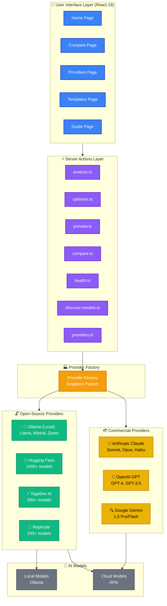
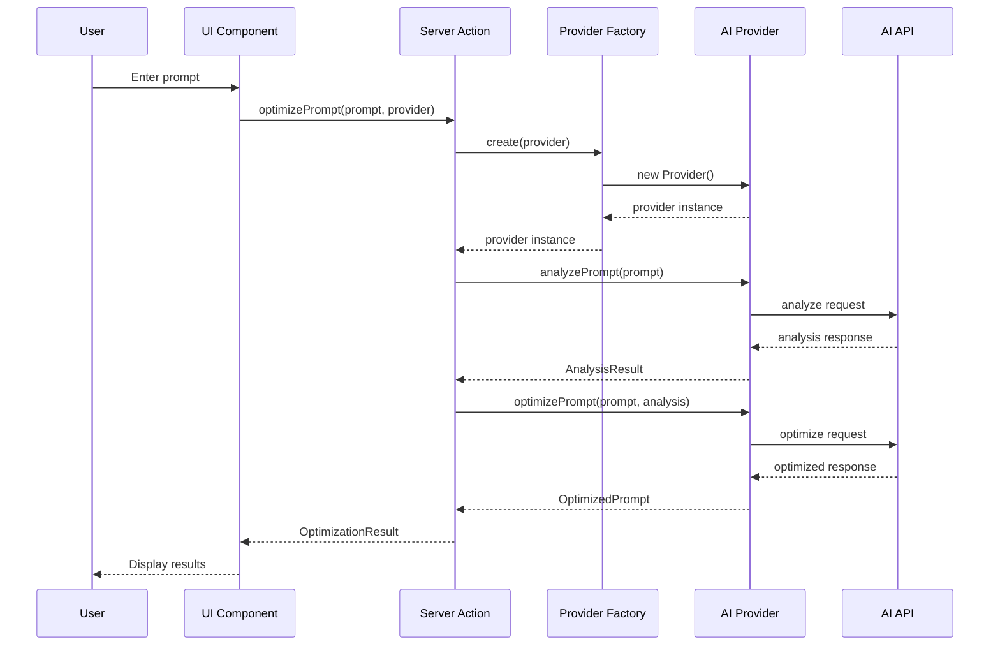
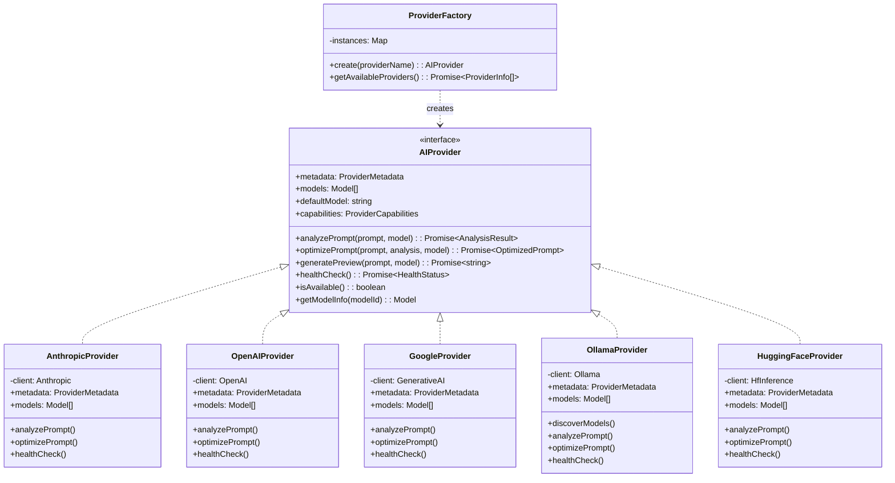
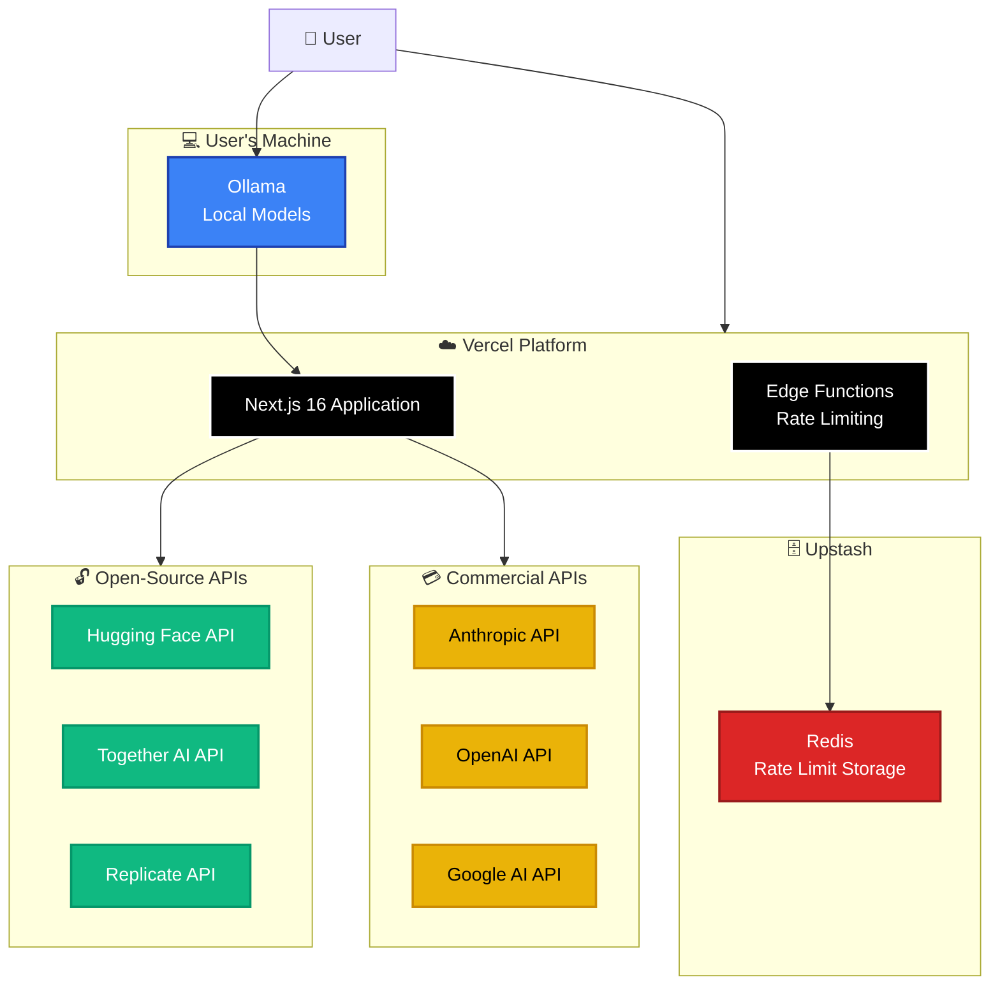
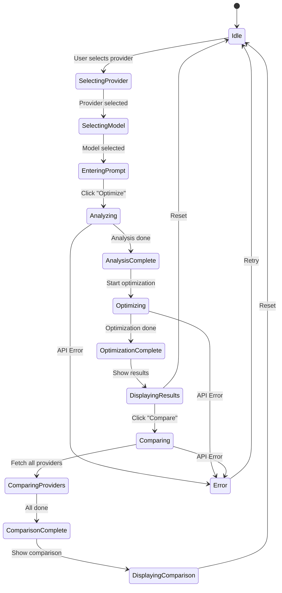

# EasyPrompt - Architecture Diagram

This document contains interactive architecture diagrams for the EasyPrompt platform.

---

## System Architecture (Mermaid - Interactive)



---

## Data Flow Diagram (Mermaid - Interactive)



---

## Provider Class Hierarchy (Mermaid - Interactive)



---

## Component Structure (Mermaid - Interactive)

```mermaid
graph LR
    subgraph ClientComponents["Client Components ('use client')"]
        PromptInput[PromptInput.tsx]
        ProviderSelector[ProviderSelector.tsx]
        ModelSelector[ModelSelector.tsx]
        OptimizeButton[OptimizeButton.tsx]
        CopyButton[CopyButton.tsx]
        HealthCheck[ProviderHealthCheck.tsx]
        Setup[LocalProviderSetup.tsx]
        Theme[ThemeToggle.tsx]
    end

    subgraph ServerComponents["Server Components (async)"]
        OptimizedDisplay[OptimizedPromptDisplay.tsx]
        AnalysisResults[AnalysisResults.tsx]
        ComparisonGrid[ComparisonGrid.tsx]
        ProviderBadge[ProviderBadge.tsx]
        HealthStatus[ProviderHealthStatus.tsx]
        ModelList[ModelList.tsx]
        ImprovementsList[ImprovementsList.tsx]
    end

    subgraph Pages["Pages (App Router)"]
        Home[app/page.tsx]
        Compare[app/compare/page.tsx]
        Providers[app/providers/page.tsx]
        Templates[app/templates/page.tsx]
        Guide[app/guide/page.tsx]
    end

    Pages --> ClientComponents
    Pages --> ServerComponents
    ClientComponents --> ServerComponents

    classDef clientStyle fill:#3b82f6,stroke:#1e40af,stroke-width:2px,color:#fff
    classDef serverStyle fill:#8b5cf6,stroke:#6d28d9,stroke-width:2px,color:#fff
    classDef pageStyle fill:#10b981,stroke:#059669,stroke-width:2px,color:#fff

    class PromptInput,ProviderSelector,ModelSelector,OptimizeButton,CopyButton,HealthCheck,Setup,Theme clientStyle
    class OptimizedDisplay,AnalysisResults,ComparisonGrid,ProviderBadge,HealthStatus,ModelList,ImprovementsList serverStyle
    class Home,Compare,Providers,Templates,Guide pageStyle
```



---

## Deployment Architecture (Mermaid - Interactive)



---

## State Management Flow (Mermaid - Interactive)



---

## File Structure Tree (Text)

```
easyprompt/
├── 📄 Configuration Files
│   ├── next.config.ts          # Next.js 16 config
│   ├── tailwind.config.ts      # Tailwind CSS 4
│   ├── tsconfig.json            # TypeScript
│   ├── proxy.ts                 # Rate limiting
│   └── .env.local               # Environment variables
│
├── 📁 app/                      # Next.js App Router
│   ├── layout.tsx               # Root layout
│   ├── page.tsx                 # Home page (optimizer)
│   ├── globals.css              # Global styles
│   ├── error.tsx                # Error boundary
│   ├── loading.tsx              # Loading UI
│   ├── compare/
│   │   └── page.tsx             # Multi-provider comparison
│   ├── providers/
│   │   └── page.tsx             # Provider management
│   ├── templates/
│   │   └── page.tsx             # Prompt templates
│   └── guide/
│       └── page.tsx             # Best practices guide
│
├── 📁 components/
│   ├── 🖥️ client/               # Client Components
│   │   ├── PromptInput.tsx
│   │   ├── ProviderSelector.tsx
│   │   ├── ModelSelector.tsx
│   │   ├── OptimizeButton.tsx
│   │   ├── CopyButton.tsx
│   │   ├── ProviderHealthCheck.tsx
│   │   ├── LocalProviderSetup.tsx
│   │   └── ThemeToggle.tsx
│   │
│   └── ⚙️ server/                # Server Components
│       ├── OptimizedPromptDisplay.tsx
│       ├── AnalysisResults.tsx
│       ├── ComparisonGrid.tsx
│       ├── ProviderBadge.tsx
│       ├── ProviderHealthStatus.tsx
│       ├── ModelList.tsx
│       └── ImprovementsList.tsx
│
├── 📁 lib/
│   ├── ⚡ actions/               # Server Actions
│   │   ├── analyze.ts
│   │   ├── optimize.ts
│   │   ├── preview.ts
│   │   ├── compare.ts
│   │   ├── health.ts
│   │   ├── discover-models.ts
│   │   └── providers.ts
│   │
│   ├── 🤖 providers/            # AI Provider Adapters
│   │   ├── base.ts              # AIProvider interface
│   │   ├── factory.ts           # ProviderFactory
│   │   ├── types.ts             # Shared types
│   │   ├── errors.ts            # Custom errors
│   │   │
│   │   ├── 💳 commercial/
│   │   │   ├── anthropic.ts     # Claude
│   │   │   ├── openai.ts        # GPT
│   │   │   └── google.ts        # Gemini
│   │   │
│   │   └── 🔓 open-source/
│   │       ├── ollama.ts        # Local
│   │       ├── huggingface.ts   # Cloud
│   │       ├── together.ts      # Cloud
│   │       └── replicate.ts     # Cloud
│   │
│   ├── 💬 prompts/              # System Prompts
│   │   ├── analysis.ts
│   │   ├── optimization.ts
│   │   └── templates.ts
│   │
│   ├── constants.ts             # App constants
│   └── utils.ts                 # Utilities
│
├── 📁 types/
│   └── index.ts                 # TypeScript types
│
└── 📁 docs/                     # Documentation
    ├── README.md
    ├── ARCHITECTURE.md
    ├── CONTRIBUTING.md
    ├── PROJECT_COMPLETION_PLAN.md
    ├── PROJECT_STATUS.md
    ├── NEXT_STEPS.md
    ├── ANALYSIS_SUMMARY.md
    └── ARCHITECTURE_DIAGRAM.md  # This file
```

---

## Technology Stack Visualization (Mermaid - Interactive)

```mermaid
graph LR
    subgraph Frontend["🎨 Frontend"]
        NextJS[Next.js 16]
        React[React 19.2]
        TypeScript[TypeScript 5.7]
        Tailwind[Tailwind CSS 4]
        RadixUI[Radix UI]
        Lucide[Lucide Icons]
    end

    subgraph Backend["⚙️ Backend"]
        ServerActions[Server Actions]
        ProviderSDKs[Provider SDKs]
        Ollama[Ollama SDK]
    end

    subgraph Infrastructure["🏗️ Infrastructure"]
        Vercel[Vercel]
        Upstash[Upstash Redis]
        RateLimit[Rate Limiting]
    end

    subgraph AISDK["🤖 AI SDKs"]
        Anthropic[Anthropic SDK]
        OpenAI[OpenAI SDK]
        Google[Google AI SDK]
        HuggingFace[HuggingFace SDK]
        Replicate[Replicate SDK]
    end

    Frontend --> Backend
    Backend --> Infrastructure
    Backend --> AISDK

    classDef frontendStyle fill:#3b82f6,stroke:#1e40af,stroke-width:2px,color:#fff
    classDef backendStyle fill:#8b5cf6,stroke:#6d28d9,stroke-width:2px,color:#fff
    classDef infraStyle fill:#f59e0b,stroke:#d97706,stroke-width:2px,color:#fff
    classDef aiStyle fill:#10b981,stroke:#059669,stroke-width:2px,color:#fff

    class NextJS,React,TypeScript,Tailwind,RadixUI,Lucide frontendStyle
    class ServerActions,ProviderSDKs,Ollama backendStyle
    class Vercel,Upstash,RateLimit infraStyle
    class Anthropic,OpenAI,Google,HuggingFace,Replicate aiStyle
```



---

## Static Diagram


---

**Note:** The Mermaid diagrams above will render interactively on GitHub, allowing you to zoom, pan, and view tooltips. The static PNG diagram is also provided as a fallback.

**Last Updated:** 2025-11-19  
**Version:** 1.0.0
